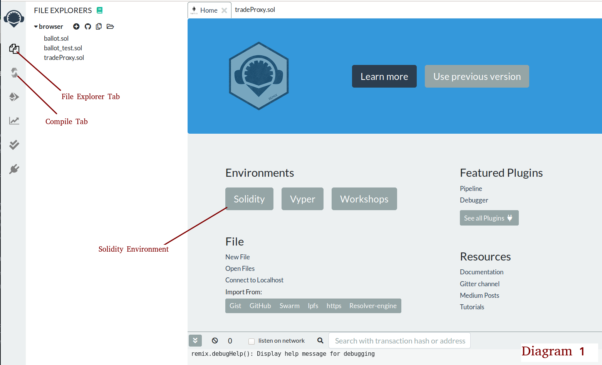
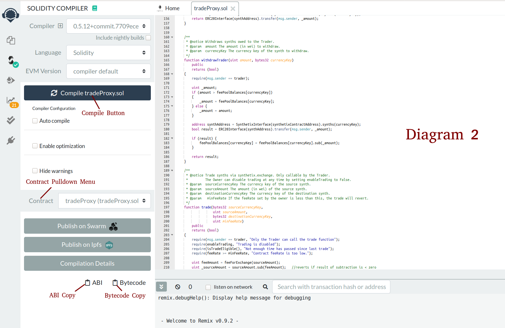
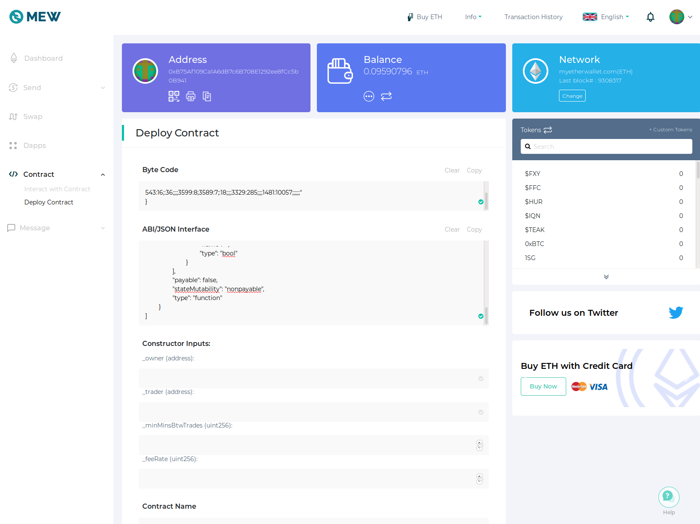
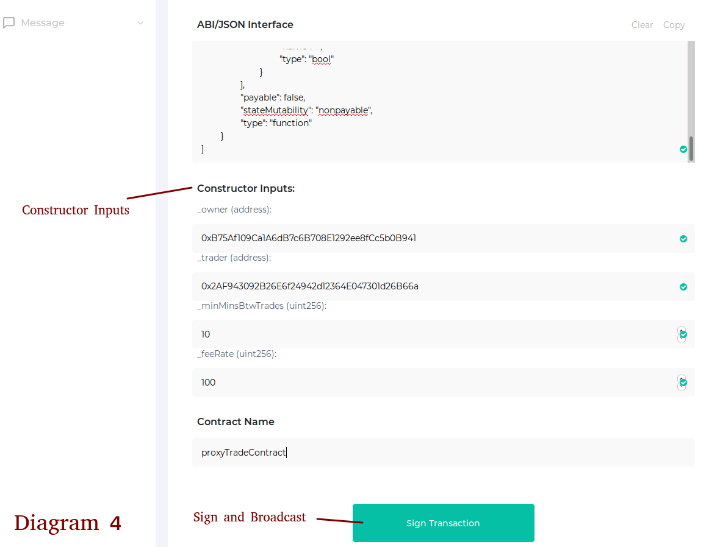

## Deployment and Interaction with the Smart Contract

This tutorial describes deployment and interaction with the Owner smart contract. As there is currently no graphic dApp, deployment and interaction will be done manually using the [Remix Compiler](https://remix.ethereum.org/) to compile the Solidity contract and deployed using [MyEtherWallet](https://www.myetherwallet.com/).

### Contract Overview

The Owner smart contract, called "tradeProxy.sol" on github, functions to hold the synths deposited by the Owner. The Owner may designate another address ("Trader") to place synth trades on behalf of the Owner. The Trader
has no other control of the owner's funds. Only the Owner can withdraw synths.

The important functions/parameters implemented by the contract include:
* *enableTrading* (settable only by the Owner). By setting this variable, the Owner can enable or disable synth trading by the Trader.
* *minMinsBtwTrades* (settable only by the Owner). This is the minimum minutes required between trades. Can be used as a safeguard against over trading by the Trading. For a strategy that trades no more than once a day, this should be set to 1440 (60*24).
* *feeRate* (settable only by the Owner). If you are using a third-party trade signal server, this should be set to the feeRate required by the third-party. Units are basis points * 100. So 1% fee would be 10000. A 0.02% fee is 200. If running your own trade signal server, set this to zero.
* *tradingStrategyLabel* (settable only by the Owner). Set this to the name of the desired TokenSet strategy (e.g., ETH20MACO). The Trader will read this to determine what strategy should be implemented.
* *withdraw* (function callable only by Owner). Used to withdraw synths from the contract to the Owner's address.
* *getBalance* (view function callable by anyone). Can be used to get the Owner's current synth balance for any synth.

### Deployment

We will be using [Remix](https://remix.ethereum.org/) to generate the bytecode for the contract. In Remix, select the "Solidity" environment. In the "File Explorer" tab, select "create new file" and paste in the [source code](https://github.com/brian0641/Synth-Sets/blob/master/contracts/tradeProxy.sol). Name the file "tradeProxy.sol" (although the name is not important; you can name it anything). The diagram below illustrates these navigation steps for navigating Remix.

With the file open in the Remix editor, select the Remix "compile tab," and then select "Compile tradeProxy.sol". The contract should compile without errors. In the "Contract" pulldown menu, select "tradeProxy". Take note of the shortcuts to copy the "Bytecode" and the "ABI" of the contract to the clipboard.

We will be using [MyEtherWallet](https://www.myetherwallet.com/) to deploy the contract to the Ethereum blockchain. MEW supports a number of techniques for storing your private key and signing transactions (not covered here). You want to deploy the contract the address that will be the Owner of the contract. The address needs to have enough Eth to pay for gas for the transactions.

Open MEW in a new browser tab and navigate to "Deploy Contract" in the "Contract" interface (diagram below). Copy and paste the Bytecode data and ABI from Remix.

    

After pasting the ABI, MEW will show the constructor fields that are required to deploy the contract. In the *owner* field, enter your address. In the *trader* field, enter the address of the Trader. If you are planning on running your own signal server, this should be another address you control. I am currently running a signal server that copies the TokenSets signals. If you want to hook into this, the following address should be entered in the *trader* field:
0x2AF943092B26E6f24942d12364E047301d26B66a

The *minMinsBtwTrades* is the minimum minutes that you require between trades (10 minutes in diagram 3). The *feeRate* field represents the fee rate (in units of basis points * 100) that you are willing to pay the provider of the signal server. The fee rate should be zero if you are running your own signal server. If using mine, enter 100. This is equivalent to one basis point (0.01%) per trade, through which I am mostly hoping to recover the gas cost.

Any value is acceptable for the "Contract Name" field.

Sign and broadcast the transaction ("Sign Transaction"). Congratulations, when the transaction is mined, you have compiled and deployed your own custom Ethereum smart contract. **Be sure to save the contract address**. If you forget to save the contract address, you can later find it by entering your address in Etherscan and searching back through the transactions.
